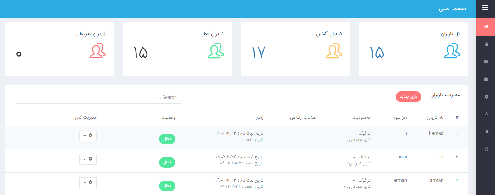
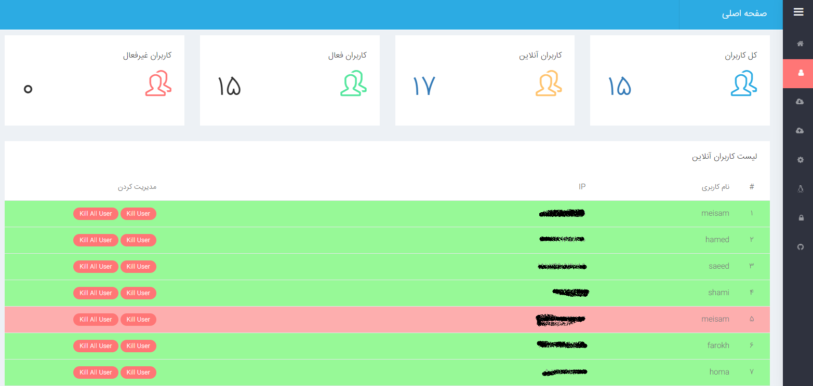
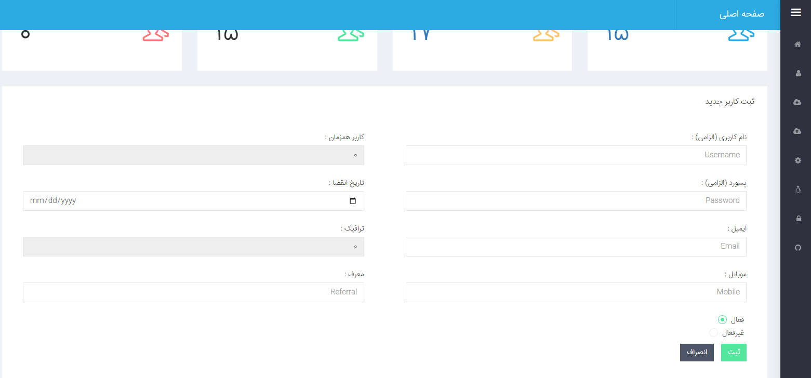
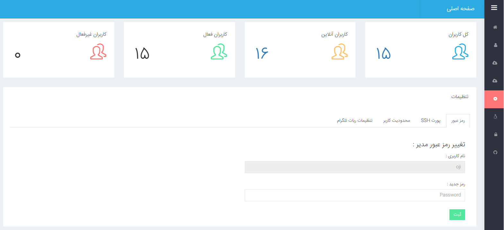
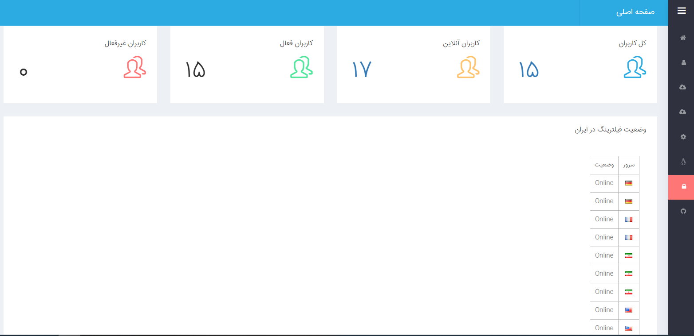
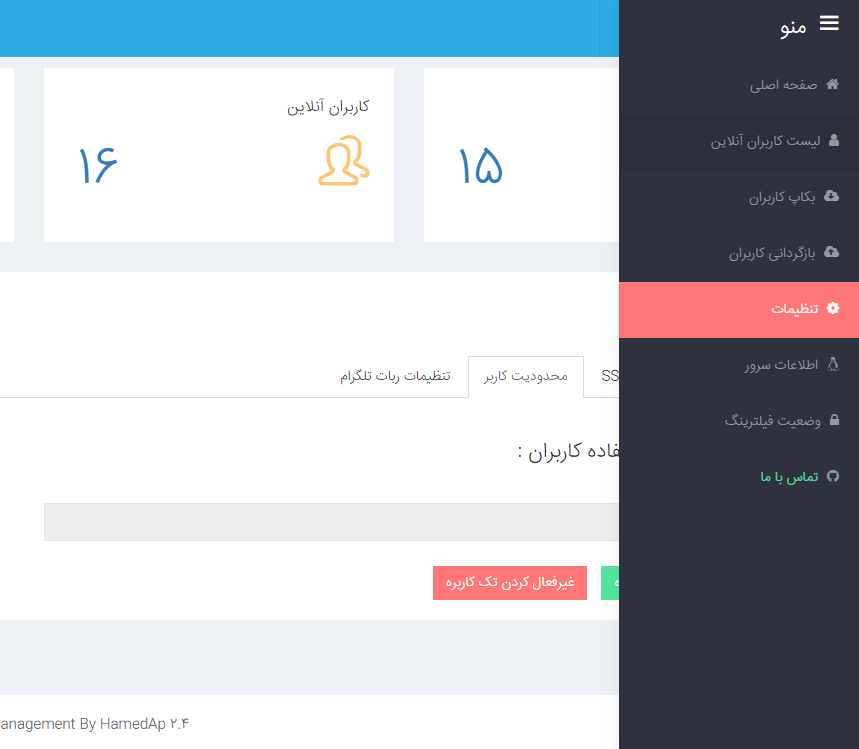

 [](https://github.com/HamedAp/Ssh-User-management/releases/latest) [](https://github.com/HamedAp/Ssh-User-management/releases/latest) 
  
# ShaHaN SSH Panel

پنل مدیریت و فروش پروتکل ssh

❇️ Connection limitation

❇️ RestApi

❇️ Multi Server

❇️ Dynamic Expire time 

❇️ Reseller 

# Telegram Channel: 

https://t.me/Shahanpanel


# حمایت مالی : 

آدرس ولت تتر : 


USDT TRC20 Address :
TWAcjmHKhqMQ58xXo4do4RgALLkfMm61Ux

USDT ERC20 Address :
0x1426afae97fef9f4928e4e171593cae9f5c630cd
 
 # حمایت قلبی 
 
  ⭐️ جهت حمایت از ما به پروژه ستاره بدین

بالا سمت راست ⭐️
 
# اموزش نصب :

دستور زیر را در ترمینال خود وارد کرده و یوزر و پسورد ادمین را وارد کنید .

*** به هیچ وجه برای نام کاربری پنل از یوزر Root استفاده نکنین .

````
bash <(curl -Ls https://raw.githubusercontent.com/HamedAp/Ssh-User-management/master/install.sh --ipv4)
````

جهت آپدیت پنل نیز همان دستور بالا را وارد کرده ( یوزر و پسورد ادمین نیاز نیست - یوزر ها پاک نمیشوند ) 


# SSL Installer ( Only SSL - NOT Panel - Need Domain )

در صورتی که دامنه دارید بعد از دستور نصب ( دقت کنید بعد از دستور نصب )  این دستور را بزنید .


````
bash <(curl -Ls https://raw.githubusercontent.com/HamedAp/Ssh-User-management/master/ssl.sh --ipv4)
````


# Will Be Added On Next Update 

-Multi Languages


# Preview







