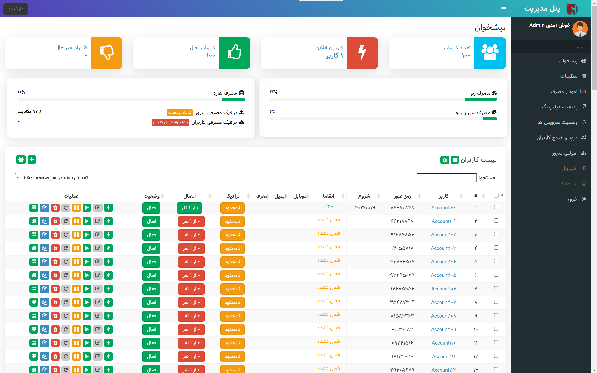
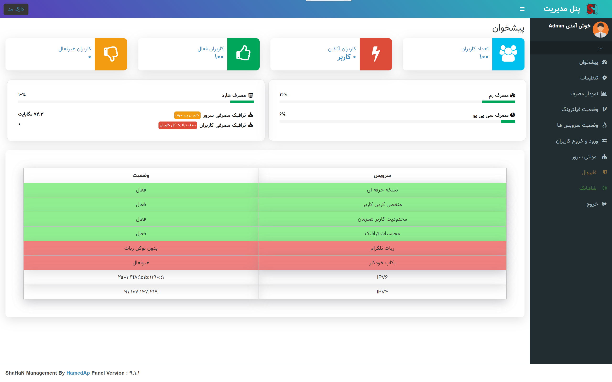
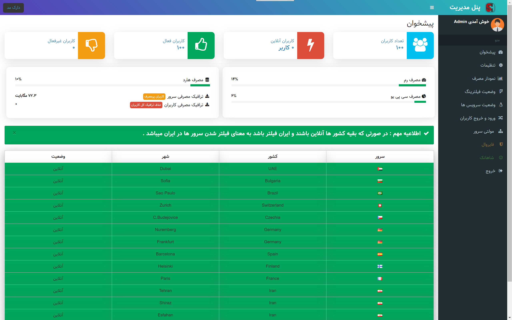
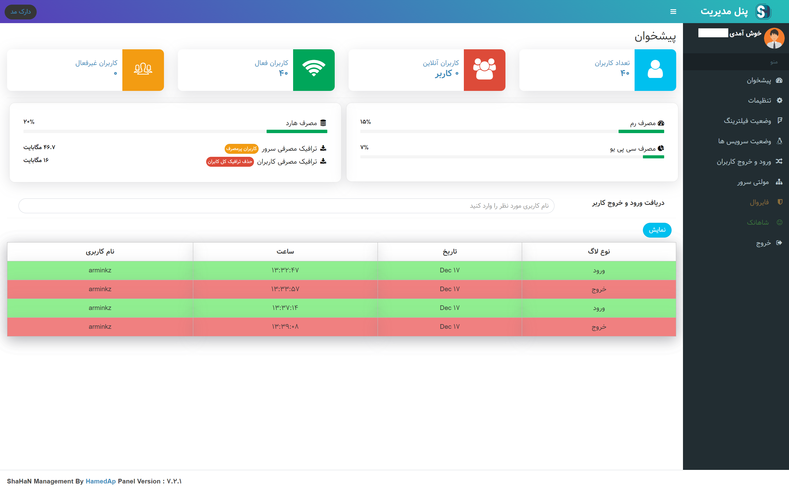

 [](https://github.com/HamedAp/Ssh-User-management/releases/latest) 
[](https://t.me/ShaHaNPanel)
[](https://t.me/shahanpanel_gp)

  
# ShaHaN VPN Panel ( Multi Protocol )

پنل مدیریت و فروش پروتکل SSH - DropBear - TUIC - Cisco

به زودی بقیه پروتکل ها اضافه می شود .


# نسخه رایگان :

اضافه کردن کاربر تکی ✔️
انلاین ها ✔️
لیست یوزر ها ✔️
حذف یوزر ✔️
ویرایش یوزر✔️
فعال غیرفعال کردن یوزر ✔️
بکاپ و ریستور ✔️
قطعی بعد از تاریخ انقضا ✔️
محدودیت چند کاربر ✔️
ریست ترافیک ✔️
محدودیت ترافیک ✔️
پورت DropBear ✔️
تم دارک و لایت ✔️
وضعیت فیلترینگ ✔️
کاربران پرمصرف ✔️


# نسخه حرفه ای 

برنامه اختصاصی اندروید ( با برند شخصی ) ✔️
برنامه اختصاصی ویندوز ( با برند شخصی ) ✔️
کاربر عمده ✔️
ربات تلگرام ( فروش خودکار ) ✔️
لاگ ورود خروج کاربران ✔️
هدیه به کاربران ✔️
حذف کاربران منقضی شده ✔️
ضدفیلتر ✔️
بکاپ خودکار ✔️
پیام اتصال ✔️
توکن API ✔️
مولتی سرور ✔️
پروتکل TUIC ✔️
پروتکل سیسکو ✔️
کانفیگ با QRCode ✔️
فایروال اختصاصی ✔️
ارسال پیام به کاربران تلگرام ✔️
ارسال بکاپ روزانه به تلگرام ✔️


 # حمایت 
 
  ⭐️ جهت حمایت از ما به پروژه ستاره بدین

بالا سمت راست ⭐️

# سیستم عامل پیشنهادی : 

- اوبونتو 20 - Ubuntu 20


 
# اموزش نصب :

دستور زیر را در ترمینال خود وارد کرده و یوزر و پسورد ادمین را وارد کنید .

*** به هیچ وجه برای نام کاربری پنل از یوزر Root استفاده نکنین .

````
bash <(curl -Ls https://raw.githubusercontent.com/HamedAp/Ssh-User-management/master/install.sh --ipv4)
````

بعد از نصب پنل میتوانید از دستور shahan در ترمینال خود استفاده کنید و گزینه های پنل رو انتخاب کنین . 


# دریافت SSL برای پنل و ربات تلگرام ( نیازمند دامنه میباشد ) 

در صورتی که دامنه دارید بعد از دستور نصب ( دقت کنید بعد از دستور نصب )  این دستور را بزنید .


````
bash <(curl -Ls https://raw.githubusercontent.com/HamedAp/Ssh-User-management/master/ssl.sh --ipv4)
````


# اسکرین شات







